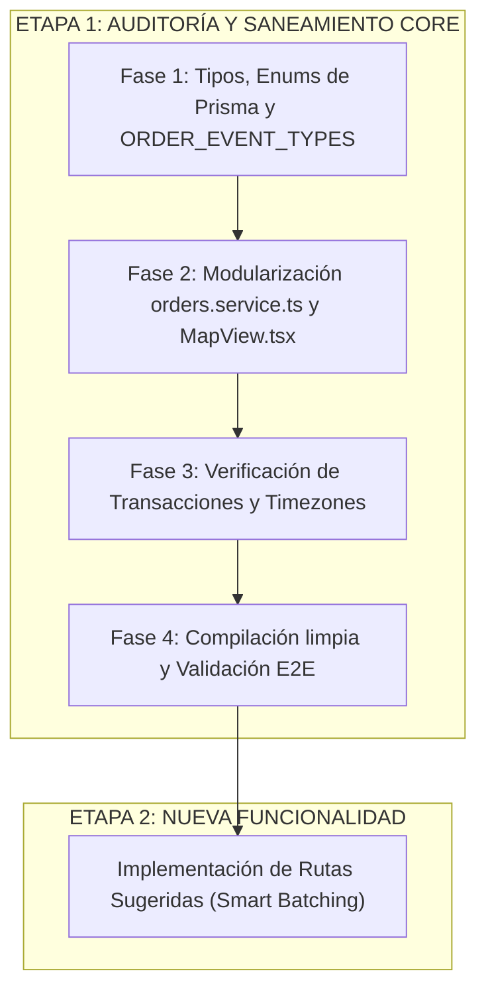

# 🔍 Plan de Auditoría Técnica Integral y Refactorización del Core (BranGo Logistics)

> **Documento Oficial de Diagnóstico, Plan de Auditoría y Acuerdos Consolidados con Claude.**  
> *Fecha: Septiembre 2026*  
> *Alcance: Core Backend (NestJS / Prisma) y Torre de Control Frontend (Next.js)*  
> *Estado: APROBADO TÉCNICAMENTE POR CLAUDE — Listo para Ejecución Secuencial.*

---

## 1. Contexto, Justificación y Diagnóstico Raíz

Durante las últimas semanas de despliegue operativo en BranGo, se implementaron múltiples soluciones y hotfixes en caliente para resolver requerimientos de producción:
- Prevención de solapamiento de rutas operativas de choferes.
- Manejo estricto de zonas horarias (`America/Lima`, UTC-5) frente a servidores en la nube en UTC.
- Agrupación atómica de pedidos consolidados en una misma parada (`stopGroupId`).
- Cierre automático nocturno (EOD) para rutas activas y trazabilidad de eventos.

Si bien la plataforma se encuentra 100% operativa y los tests/builds compilan con 0 errores, estas iteraciones rápidas generaron **tres problemas estructurales críticos en el código base**:

1. **Archivos Monolíticos Sobredimensionados**:
   - `orders.service.ts` alcanzó **1,208 líneas** concentrando responsabilidades dispares (queries de Torre de Control, cierres nocturnos automáticos, reasignaciones atómicas, gestión de evidencias fotográficas).
   - `MapView.tsx` alcanzó **791 líneas** acoplando el ciclo de vida de Google Maps, templates HTML masivos de marcadores, cálculo de jittering y listeners de sockets de telemetría.
   - `OrderDetailDrawer.tsx` supera las **625 líneas** con lógica repetitiva de mapeo de estados y eventos de historial.
2. **Proliferación de Strings Hardcodeados ("Magic Strings")**:
   - En lugar de forzar los Enums canónicos de Prisma (`AssignmentStatus`, `RouteStatus`), existen comparaciones con strings sueltos (`status === 'DELIVERED'`, `'PENDING'`, `'OBSERVED'`).
3. **Casuísticas y Parches Asimétricos**:
   - Reglas de negocio corregidas en un método específico pero con variantes legacy en otros endpoints secundarios.

---

## 2. Validación de Contratos y "Schema Truth" (Prisma vs Realidad)

Confirmado plenamente en la arquitectura de base de datos (`prisma/schema/logistica.prisma`):

| Entidad / Regla | Estado Real en Base de Datos | Implicancia para la Auditoría y Rutas Sugeridas |
| :--- | :--- | :--- |
| **`Order.status` / `Order.driverId`** | **NO existen en la tabla `Order`**. | Ambos campos residen exclusivamente en `RouteAssignment`. En `RouteAssignment`, `driverId` es obligatorio (`NOT NULL`). |
| **Pedidos Pendientes / Sin Chofer** | No tienen fila activa en `RouteAssignment`. | Se consultan canónicamente mediante: `assignments: { none: { voidedAt: null } }`. No existe el caso de `driverId: null` en base de datos. |
| **Reintentos de Observados** | Tienen asignación previa con `status: OBSERVED`. | Se reactivan o reasignan anulando la asignación previa (`voidedAt: now()`) y creando la nueva asignación. |
| **Paradas Consolidadas (`stopGroupId`)** | Campo `stopGroupId String?` en `Order`. | Si varios pedidos comparten `stopGroupId`, representan una única parada física en las mismas coordenadas GPS. |

---

## 3. Delimitación del Alcance (Los 4 Módulos + Ajuste de Consistencia)

```
┌─────────────────────────────────────────────────────────────────────────────┐
│                         ALCANCE DE LA AUDITORÍA                             │
├───────────────────────────┬─────────────────────────────────────────────────┤
│ MÓDULO                    │ ARCHIVOS CRÍTICOS INVOLUCRADOS                  │
├───────────────────────────┼─────────────────────────────────────────────────┤
│ 1. Órdenes y Asignación   │ orders.service.ts (1,208 lín), pedidos.api.ts,  │
│    (Orders & Lifecycle)   │ order-stops-grouping.ts, order-pauses.service.ts│
├───────────────────────────┼─────────────────────────────────────────────────┤
│ 2. Rutas y Torre Control  │ MapView.tsx (791 lín), routes.service.ts,       │
│    (Routes & Dispatch)    │ routes.controller.ts, RouteBuilderPanel.tsx     │
├───────────────────────────┼─────────────────────────────────────────────────┤
│ 3. Historial y Eventos    │ OrderEvent (Prisma), OrderDetailDrawer.tsx,     │
│    (Audit Trail)          │ whatsapp.channel.ts*, tracking.gateway.ts*      │
├───────────────────────────┼─────────────────────────────────────────────────┤
│ 4. Fechas y Zonas Horarias│ date.util.ts, orderValidity.utils.ts,           │
│    (Timezone & SLAs)      │ getLimaDayRange (America/Lima UTC-5)            │
└───────────────────────────┴─────────────────────────────────────────────────┘
```
*\*Nota sobre WhatsApp y WebSockets: Tal como solicitó Claude, aunque su lógica de negocio queda intacta, se incluyen estrictamente para unificar sus referencias a `ORDER_EVENT_TYPES` y erradicar strings sueltos.*

### Lo que queda 100% FUERA de esta Auditoría:
- ❌ **App Móvil (`bran-go-mobile`)**: Intacta (estable en Expo 57).
- ❌ **Lógica funcional de envíos de WhatsApp y Pasarela Socket**: Intacta.
- ❌ **Módulos de Auth, Clientes y Catálogo de Negocio**: Intactos.

---

## 4. Respuestas y Acuerdos Técnicos con Claude

### 1. Descomposición de `orders.service.ts` -> Patrón Facade Aprobado
- **Criterio de Claude**: Mantener `OrdersService` como fachada liviana (< 200 líneas) delegando a `OrdersQueryService`, `OrdersLifecycleService` y `OrdersStatusService` es la decisión correcta.
- **Razón**: Minimiza el *blast radius* del refactor. Si se inyectaran los sub-servicios directo en los controladores, se rompería la interfaz pública que ya usan otros módulos (`StopConsolidationService`, `OrderPausesService`, y el futuro `SuggestedRoutesService`).

### 2. Modelado de `OrderEvent.type` -> String + Enum de TypeScript Aprobado
- **Criterio de Claude**: Mantenerlo como `String` en PostgreSQL respaldado por constante/enum canónico en TypeScript (`ORDER_EVENT_TYPES as const`).
- **Razón**: Migrar a `enum OrderEventType` nativo en PostgreSQL exigiría `ALTER TYPE` con migraciones SQL delicadas en producción cada vez que surja un nuevo tipo de evento. La tipificación en TypeScript ofrece 100% de seguridad en tiempo de compilación con cero costo operativo.

### 3. Limpieza de `AdvancedMarkerElement` en `MapView.tsx` -> Prevenir Memory Leaks
- **Criterio de Claude**: Mantener una referencia `Map<string, google.maps.marker.AdvancedMarkerElement>` fuera del ciclo de render de React.
- **Patrón**: En el cleanup del `useEffect`, iterar explícitamente y ejecutar `marker.map = null` antes de limpiar el `Map`. Esto desvincula los listeners y evita fugas de memoria en Google Maps JS API.

---

## 5. Resolución de Preocupaciones de Claude

### ⚠️ Preocupación 1: Secuenciación Estricta (No Paralelizar)
- **Solución Acordada**: Se ejecutará en secuencia estricta:
  1. **Primero**: Auditoría y Saneamiento del Core (Fase 1 y Fase 2).
  2. **Segundo**: Implementación del nuevo ticket "Rutas Sugeridas" sobre los servicios ya modularizados.
- **Beneficio**: Evita colisiones de merge y garantiza que `SuggestedRoutesService` consuma la nueva arquitectura limpia.

### ⚠️ Preocupación 2: Inclusión de WhatsApp y WebSockets en `ORDER_EVENT_TYPES`
- **Solución Acordada**: Aunque la lógica de negocio de `whatsapp.channel.ts` y `tracking.gateway.ts` no se altera, se actualizan sus importaciones y llamadas a `prisma.orderEvent.create` para utilizar la constante canónica `ORDER_EVENT_TYPES`. Así se garantiza una única fuente de verdad en toda la plataforma.

---

## 6. Fases de Ejecución Secuencial (Plan de Trabajo Paso a Paso)



### Detalle de las Fases de la Etapa 1:

#### Fase 1: Tipos, Enums de Prisma y Centralización de Eventos (Riesgo: 0)
- Erradicar strings mágicos en Backend y Frontend (`AssignmentStatus.PENDING`, `AssignmentStatus.DELIVERED`, `AssignmentStatus.OBSERVED`, `RouteStatus.COMPLETED`, etc.).
- Definir constante unificada `ORDER_EVENT_TYPES` y adoptarla en:
  - `orders.service.ts`
  - `OrderDetailDrawer.tsx` (reemplazando los 80 `if/else` por mapa `EVENT_RENDER_CONFIG`)
  - `whatsapp.channel.ts`
  - `tracking.gateway.ts`
- *Validación*: Compilación `npm run build` sin errores en backend y frontend.

#### Fase 2: Modularización de Monolitos con Facade (Riesgo: Mínimo)
- **Backend**: Descomponer `orders.service.ts` (1,208 lín) en:
  - `OrdersQueryService` (~250 lín): `findToday`, `findAll`, filtros de Torre de Control.
  - `OrdersLifecycleService` (~300 lín): creación, reasignaciones atómicas y auto-cierre EOD.
  - `OrdersStatusService` (~250 lín): transiciones de estado, evidencias y notas.
  - `OrdersService` (~150 lín): Fachada que preserva la interfaz pública exacta.
- **Frontend**: Descomponer `MapView.tsx` (791 lín):
  - Extraer generadores HTML a `mapMarkers.builder.ts`.
  - Aplicar patrón de cleanup seguro con `Map<string, AdvancedMarkerElement>` (`marker.map = null`).
- *Validación*: `npm run build` y verificación de inyección de dependencias en NestJS.

#### Fase 3: Consistencia Transaccional y Zonas Horarias
- Auditar consultas Prisma para garantizar el uso estricto de `getLimaDayRange()` en rangos de fecha.
- Verificar atocimidad con `$transaction` en `routes.service.ts` (`createRoute`, `cancelRoute`).

#### Fase 4: Validación Integral de Regresión
- Verificar que el flujo logístico diario funciona exactamente igual:
  - Importación/creación de pedidos.
  - Asignación manual a chofer y despacho.
  - Telemetría en vivo en Torre de Control.
  - Entrega con evidencia y cierre EOD.

---

## 7. Paso Siguiente Inmediato
Una vez completada y verificada la **Etapa 1 (Auditoría Core)**, se procede de inmediato con la **Etapa 2 (Rutas Sugeridas v2.0)** sobre una base sólida y desacoplada.
