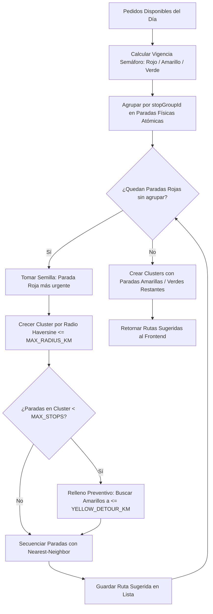
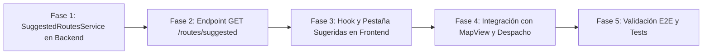

# 🗺️ Plan de Implementación: Autogeneración de Rutas Sugeridas en Torre de Control (Smart Batching) — Etapa 2

> **Documento Oficial de Arquitectura y Diseño Técnico para la Etapa 2.**  
> *Estado: Validado previamente con Claude y listo para ejecución sobre la base saneada del Core.*  
> *Objetivo: Agrupar automáticamente pedidos pendientes priorizando urgencias (Semáforo Rojo) y proximidad geográfica.*

---

## 1. Justificación y Objetivos de Negocio

### 1.1 El Problema Operativo Actual
En la **Torre de Control**, el operador logístico debe armar rutas seleccionando manualmente pedido por pedido en la lista o el mapa:
- Con 30-50+ pedidos diarios, identificar visualmente cuáles están en riesgo de vencer (**Vigencia en ROJO**) y qué chofer o zona tiene la mejor proximidad es lento, propenso a errores humanos y genera trayectos cruzados por la ciudad.

### 1.2 La Solución de la Etapa 2
Incorporar un **Motor de Rutas Sugeridas (Smart Batching Engine)** que:
1. Analiza los pedidos disponibles del día.
2. Identifica y prioriza los pedidos en riesgo (**Vigencia ROJA**).
3. Agrupa por clusters geográficos urbanos usando distancia Haversine.
4. Trata paradas consolidadas (`stopGroupId`) como una sola parada física atómica.
5. Secuencia la ruta usando el algoritmo *Nearest-Neighbor*.
6. Presenta las rutas recomendadas en una nueva pestaña **"Sugeridas"** en el panel de despacho de Torre de Control.
7. Permite **asignar chofer y despachar con 1 clic**, o **"Transferir a Manual"** para ajustar paradas a discreción.

---

## 2. Reglas del Modelo de Datos (Prisma Schema Truth)

Tal como validamos en la auditoría técnica con Claude:
- `Order` **no tiene campos `status` ni `driverId`**. Ambos residen exclusivamente en `RouteAssignment`.
- Un pedido sin chofer **no tiene ninguna fila activa en `RouteAssignment`**.
- El motor de sugerencias consulta estrictamente dos universos de pedidos:
  1. **Pedidos Nuevos Sin Asignar**: `isPaused: false`, `latitude !== null`, y `assignments: { none: { voidedAt: null } }`.
  2. **Reintentos de Observados**: Pedidos cuya última asignación fue `status: AssignmentStatus.OBSERVED` y no tienen ninguna asignación activa para hoy o fechas futuras (`assignments: { some: { status: 'OBSERVED', voidedAt: null }, none: { date: { gte: startOfDay }, voidedAt: null } }`).

---

## 3. Manejo de Paradas Consolidadas (`stopGroupId`)

Si varios pedidos comparten el mismo `stopGroupId`:
1. **Unidad Atómica de Parada**: Cuentan como **1 sola parada física** para el límite de paradas de la ruta (`MAX_STOPS`), aunque contengan 2 o más pedidos.
2. **Coordenadas Únicas**: Se evalúan en las coordenadas GPS comunes del grupo.
3. **Herencia de Prioridad**: Si al menos un pedido del grupo tiene vigencia en **ROJO**, **toda la parada consolidada hereda prioridad ROJA**.

---

## 4. Algoritmo de Sugerencia: Greedy Seed-and-Grow + Nearest Neighbor

Siguiendo la disciplina de costos acordada, el clustering y secuenciación se calculan con **matemática pura Haversine en memoria (gratis, 0ms de latencia, 0 cuota de Google)**. Google Directions solo se invoca en el frontend cuando el operador hace clic para ver la ruta en el mapa.



### Parámetros de Configuración del Algoritmo
```typescript
export const ROUTE_SUGGESTION_CONFIG = {
  MAX_STOPS_PER_ROUTE: 12,       // Límite máximo de paradas físicas por ruta
  MAX_CLUSTER_RADIUS_KM: 4.5,    // Radio máximo para agrupar paradas en un cluster
  YELLOW_DETOUR_KM: 2.0,         // Desvío máximo para sumar un pedido amarillo a un cluster rojo
  MAX_ROUTES_SUGGESTED: 5,       // Cantidad máxima de rutas sugeridas a retornar
};
```

---

## 5. Cambios Concretos por Componente

### Backend (`bran-go-backend`)

#### 1. [NEW] `src/modules/routes/services/suggested-routes.service.ts`
- Implementa el motor de sugerencias:
  - `getSuggestedRoutes(date?: string): Promise<SuggestedRouteDto[]>`
  - Filtro canónico de pedidos disponibles.
  - Agrupación por `stopGroupId`.
  - Clustering Greedy Seed-and-Grow.
  - Secuenciación Nearest-Neighbor desde la sede de despacho o parada semilla.

#### 2. [MODIFY] `src/modules/routes/routes.controller.ts`
- Añadir endpoint de solo lectura:
  ```typescript
  @Get('suggested')
  @UseGuards(JwtAuthGuard, RolesGuard)
  @Roles(ROLES.SYS_ADMIN, ROLES.SYS_OPERATOR)
  async getSuggestedRoutes(@Query('date') date?: string) {
    return this.suggestedRoutesService.getSuggestedRoutes(date);
  }
  ```
  *(Solo lectura: no guarda nada en base de datos hasta que el operador confirme)*.

#### 3. [MODIFY] `src/modules/routes/routes.module.ts`
- Registrar `SuggestedRoutesService` en providers.

---

### Frontend (`bran-go-frontend`)

#### 1. [NEW] `src/features/torre-control/hooks/useSuggestedRoutes.ts`
- Hook de React Query para consultar `GET /routes/suggested`.
- Permite refrescar sugerencias cuando cambian los pedidos o tras despachar una ruta.

#### 2. [MODIFY] `src/features/torre-control/components/RouteBuilderPanel.tsx`
- Añadir selector de pestañas en la cabecera del panel:
  - **`Manual`** (modo actual 100% intacto).
  - **`Sugeridas ✨`** (nuevo modo inteligente).
- En la pestaña **`Sugeridas`**:
  - Lista de tarjetas con las rutas recomendadas:
    - Etiqueta de zona (ej: *"Ruta Sugerida 1 — San Isidro / Miraflores"*).
    - Métricas clave: Cantidad de paradas, pedidos críticos (Rojo), pedidos preventivos (Amarillo).
    - Selector de Chofer integrado en la tarjeta.
    - Botón **"Despachar Ruta"** (usa el endpoint existente `POST /routes`).
    - Botón **"Editar en Manual"** (pasa los `orderIds` de la sugerencia a la pestaña Manual para agregar o quitar paradas antes de guardar).

#### 3. [MODIFY] `src/features/torre-control/components/MapView.tsx`
- Al seleccionar una ruta sugerida en el panel, el mapa:
  - Resalta las paradas de la sugerencia con numeración secuencial (1, 2, 3...).
  - Dibuja la polilínea vial vial uniendo los puntos con Google Directions (`useMapRoute`).

---

## 6. Fases de Ejecución de la Etapa 2



1. **Fase 1**: Crear `suggested-routes.service.ts` con el algoritmo Haversine, cálculo de vigencia y agrupación por `stopGroupId`.
2. **Fase 2**: Exponer endpoint `GET /routes/suggested` en `routes.controller.ts`.
3. **Fase 3**: Implementar hook `useSuggestedRoutes` y la pestaña "Sugeridas" en `RouteBuilderPanel.tsx`.
4. **Fase 4**: Conectar la previsualización de polilíneas en `MapView.tsx` y el botón de despacho / transferencia a manual.
5. **Fase 5**: Validar en dev con pedidos reales del día, compilar backend y frontend sin errores.

---

## 7. Garantías de No Regresión
- **Pestaña Manual Intacta**: El flujo de ruteo manual actual no sufre alteraciones.
- **Sin Efectos Secundarios en BD**: El endpoint de sugerencias es `GET` puro (idempotente y de solo lectura). La base de datos solo se modifica cuando el operador presiona el botón formal de creación de ruta.
- **Disciplina de Costos**: Cero llamadas a APIs de pago para el clustering; solo Haversine matemático local.
