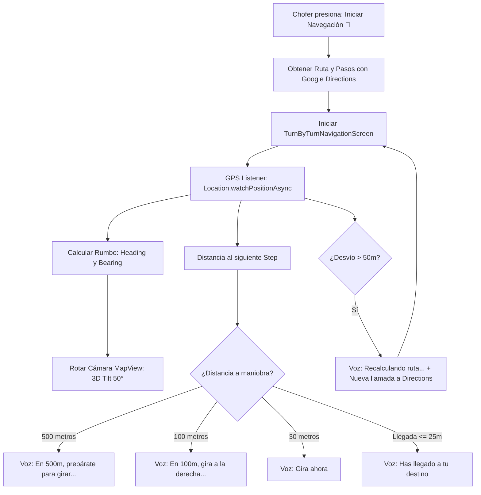
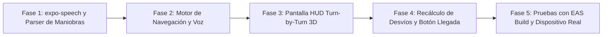

# 🧭 Plan de Implementación: Navegación Móvil Giro a Giro con Voz en Vivo (Simulación Google Maps a $0 Costo)

> **Documento Oficial de Arquitectura y Especificación Técnica para la App Móvil (`bran-go-mobile`).**  
> *Objetivo: Brindar al chofer una experiencia de navegación giro a giro (Turn-by-Turn) idéntica a Google Maps / Waze, con voz en vivo en español, cámara 3D rotatoria y recálculo automático de desvíos, a un costo de **$0.00 USD/mes** (sin el SDK Google Navigation Enterprise de ~$900 USD).*  
> *Para revisión y aprobación de Claude y el equipo técnico.*

---

## 1. Justificación y Análisis de Costos

### 1.1 El Problema de Google Navigation SDK Enterprise
Google cobra el SDK nativo de navegación comercial bajo el modelo *Navigation SDK for Mobile*:
- **Costo**: Entre **$0.05 y $0.15 USD por cada viaje navegado**.
- En una flota de 15-20 choferes realizando múltiples rutas o paradas diarias (~300 viajes/día):
  $$\text{Costo Mensual} = 300 \text{ viajes} \times 0.10 \text{ USD} \times 26 \text{ días} \approx \mathbf{780 - 900 \text{ USD / mes}}$$
- Además, exige contratos anuales de *Google Cloud Mobility Enterprise* con verificación de crédito y tarjeta bancaria internacional.

### 1.2 La Solución de BranGo: Navegación Nativa con SKU Directions Gratuito
Replicar la experiencia visual y auditiva de Google Maps combinando tecnologías ya existentes en el dispositivo móvil:

| Componente | Solución Enterprise de Pago (~$900/mes) | Nuestra Solución de Alta Eficiencia (**$0.00 USD**) |
| :--- | :--- | :--- |
| **Voz en Vivo** | Google Cloud Text-to-Speech API (de pago por caracteres) | **`expo-speech`** usando el motor TTS nativo del sistema operativo (Android/iOS). **100% gratis, ilimitado y funciona offline.** |
| **Paso a Paso (Steps)** | Google Navigation SDK ($25/1k + Mobility Licensing) | **Google Directions API / Routes Essentials**: se invoca al inicio de la ruta a la parada. Cubierto por el **Free Usage Cap oficial por SKU de 10,000 solicitudes/mes a $0 USD** (vigente post-marzo 2025). |
| **Vista 3D y Rotación** | Navigation View propietario | **`react-native-maps`** con `pitch: 50°` (inclinación 3D) y `heading: driverBearing` (el mapa gira según la brújula y dirección del chofer). |
| **Detección de Desvío** | Motor de Google (Navigation SDK) | **Matemática local en el móvil**: si el chofer se aleja > 50 metros del trazo de la calle durante 3 lecturas GPS consecutivas (~8-10s), dispara recálculo controlado con cooldown de 25s. |

### 1.3 Análisis de Costos Oficiales Vigentes (Esquema por SKU Post-Marzo 2025)
> **Nota de actualización de facturación**: Desde marzo de 2025, Google eliminó el crédito transversal global de $200 USD/mes y lo reemplazó por **cuotas gratuitas mensuales independientes por SKU** (*Monthly Free Usage Cap*).

1. **Cuota Gratuita Oficial por SKU (Verificada en [Google Maps Platform Official Pricing](https://developers.google.com/maps/billing-and-pricing/pricing))**:
   - **SKU `Directions` (Legacy, ID `28A8-3EB4-4595`)**:
     - Endpoint consumido por la app: `https://maps.googleapis.com/maps/api/directions/json` (ver [`directions.service.ts`](file:///c:/Users/Juan/Desktop/Front/BranGo/bran-go-mobile/src/features/tracking/services/directions.service.ts#L59)).
     - **Free Usage Cap mensual**: **10,000 solicitudes / mes gratis ($0.00 USD)**.
     - Tramo excedente (10,001 - 100,000): $5.00 USD por cada 1,000 solicitudes ($0.005/solicitud).
   - **SKU `Routes: Compute Routes Essentials` (ID `9EFF-679A-9B16`)**:
     - Endpoint moderno gRPC/REST: `https://routes.googleapis.com/directions/v2:computeRoutes`.
     - **Free Usage Cap mensual**: **10,000 solicitudes / mes gratis ($0.00 USD)**.
   - **Verificación en Google Cloud Console**:
     - *Ruta en Consola GCP*: Ir a [Google Cloud Console > APIs y Servicios > Google Maps Platform > Cuotas](https://console.cloud.google.com/google/maps-apis/api-list) -> Clic en **Directions API** -> Pestaña **Cuotas**.
     - *Ruta en Facturación GCP*: Ir a [Google Cloud Console > Billing > Informes](https://console.cloud.google.com/billing) -> Filtrar por Servicio: `Google Maps Platform` -> SKU: `Directions` (ID `28A8-3EB4-4595`).

2. **Cálculo de Volumen Agregado Total a Escala de Flota**:
   - **Volumen Base Nominal**: 300 viajes/despachos diarios en toda la flota × 26 días operativos/mes = **7,800 llamadas mensuales agregadas**.
   - **Consumo de la Cuota Gratuita**: 7,800 / 10,000 = **78% de la cuota mensual gratuita**.
   - **Margen de seguridad restante**: **2,200 llamadas gratuitas al mes** disponibles para desvíos sin costo alguno.
   - **Costo mensual nominal agregado**: **$0.00 USD / mes**.

3. **Modelado de Desvíos de Ruta (Off-Route Re-routing)**:
   - **Escenario Operativo Típico (+20% a +28% de recálculos por desvíos)**:
     - 7,800 viajes + 2,184 recálculos = **9,984 llamadas/mes** (< 10,000 cap) $\rightarrow$ **$0.00 USD / mes**.
   - **Escenario con Tráfico Severo (+35% de recálculos por desvíos)**:
     - 7,800 viajes + 2,730 recálculos = **10,530 llamadas/mes**.
     - Excedente facturable: 530 llamadas a $5.00/1,000 $\rightarrow$ **$2.65 USD / mes**.
   - **Peor Escenario Extremo (100% de los viajes sufren un desvío = 2 llamadas por viaje)**:
     - 15,600 llamadas/mes = 10,000 gratis + 5,600 facturables $\rightarrow$ **$28.00 USD / mes** (frente a **$780 - $1,170 USD** con el SDK Enterprise).

## 2. Arquitectura de Navegación en `bran-go-mobile`



---

## 3. Especificación de Componentes y Archivos

### 3.1 [NUEVA DEPENDENCIA] `expo-speech`
- Se instala mediante: `npx expo install expo-speech`
- Utiliza `android.speech.tts.TextToSpeech` en Android y `AVSpeechSynthesizer` en iOS.
- No consume datos de internet para la síntesis de voz.
- Configuración en español neutro / Perú: `language: 'es-PE'`, `pitch: 1.0`, `rate: 0.95`.

---

### 3.2 [NUEVO SERVICIO] `src/features/tracking/services/voice-guidance.service.ts`
Controlador inteligente de avisos sonoros para evitar saturar al conductor:
- **Prevención de Spam Auditivo (Debouncing)**: No repite la misma instrucción en menos de 8 segundos a menos que la maniobra sea inminente.
- **Fases de Anuncio**:
  1. *Aviso Lejano*: A 500 m (solo si velocidad > 40 km/h) o 300 m (tráfico urbano).
  2. *Aviso Medio*: A 120 - 150 m (*"En 150 metros, gira a la derecha en Avenida Javier Prado"*).
  3. *Aviso Inminente*: A 30 - 40 m (*"Gira a la derecha ahora"*).
  4. *Aviso de Arribo*: A menos de 25 m (*"Has llegado a la parada de COMERCIAL AQUAMUNDO"*).
- **Control de Silencio**: Permite al chofer silenciar la voz en cualquier momento con un botón de altavoz en pantalla.

---

### 3.3 [NUEVO SERVICIO] `src/features/tracking/services/navigation-engine.service.ts`
Motor matemático de posicionamiento y seguimiento de calle:
- **Parser de Maniobras**: Extrae y sanitiza el texto HTML de Google Directions (`html_instructions` -> texto plano para voz).
- **Mapeo de Iconos**: Traduce `maneuver` (`turn-right`, `turn-left`, `fork-right`, `roundabout`, `merge`) a iconos vectoriales de `@expo/vector-icons` (flechas curvas, bifurcaciones).
- **Cálculo de Proyección Ortogonal**: Determina si el punto GPS actual del chofer sigue dentro de la calle trazada o si se desvió por otra avenida (>50 metros de la polilínea).

---

### 3.4 [NUEVA PANTALLA] `src/features/tracking/screens/TurnByTurnNavigationScreen.tsx`
Interfaz inmersiva inspirada en el diseño estándar de Google Maps / Waze:

```
┌────────────────────────────────────────────────────────┐
│  🟢 [⬅ Flecha 90°]  En 150 m                           │
│  Gira a la izquierda en Av. Las Palmeras               │
│  Luego: continúa recto 2.5 km                          │
├────────────────────────────────────────────────────────┤
│                                                        │
│                  MAPA EN PERSPECTIVA 3D                │
│                   (Cámara inclinada 50°)               │
│               Vehículo 🚚 apuntando hacia arriba       │
│                                                        │
├────────────────────────────────────────────────────────┤
│  ⏱ 14 min  •  4.8 km  •  Llegada 10:45 AM     [🔊]   │
│  [ Recientrar 📍 ]        [ Llegué a la Entrega ✓ ]    │
└────────────────────────────────────────────────────────┘
```

* **Caja Superior de Maniobra (HUD)**:
  * Fondo verde oscuro de alto contraste (`#0F5132` / `#1E293B`).
  * Icono de giro gigante visible a un golpe de vista desde el soporte del auto.
  * Texto de la calle y metros decreciendo en tiempo real conforme avanza el auto.
* **Cámara Dinámica de Mapa**:
  ```typescript
  mapRef.current?.animateCamera({
    center: { latitude: driverLat, longitude: driverLng },
    pitch: 50,           // Efecto 3D
    heading: driverHeading, // Rota el mapa para que el auto siempre apunte hacia el frente
    zoom: 17.5,          // Zoom de calle
  }, { duration: 800 });
  ```
* **Barra Inferior de Estado**:
  * Tiempo restante estimado (ETA).
  * Distancia total restante.
  * Botón de altavoz (Mute / Unmute).
  * Botón "Llegué a la Parada": Cierra la navegación y abre directamente la cámara de evidencia fotográfica (`CameraScreen.tsx`).

---

### 3.5 [MODIFICAR] `src/features/orders/screens/RoadmapScreen.tsx`
- En la tarjeta del pedido activo o en el menú flotante:
  - Añadir botón destacado **"Iniciar Navegación 🧭"** junto al pedido que está en estado `IN_TRANSIT`.
  - Al pulsar, abre `TurnByTurnNavigationScreen` pasando las coordenadas de destino y los datos del pedido.

---

## 4. Fases de Ejecución



1. **Fase 1**: Instalar `expo-speech` y ampliar `directions.service.ts` para extraer `steps`, `maneuver` y distancias parciales de Google Directions API.
2. **Fase 2**: Implementar `voice-guidance.service.ts` con control de cadencia y debouncing.
3. **Fase 3**: Diseñar `TurnByTurnNavigationScreen.tsx` con el HUD superior de maniobra, cámara con inclinación 3D y rotación por `heading`.
4. **Fase 4**: Añadir la lógica de detección de desvíos (>50 metros) y transición hacia la pantalla de entrega con evidencia fotográfica.
5. **Fase 5: Despliegue, Protección GCP (Hard Cap) y Validación en Dispositivo**:
   - **Checklist Obligatorio de Infraestructura en Google Cloud Console (Administrador)**:
     1. Entrar a [GCP Console > APIs y Servicios > Cuotas](https://console.cloud.google.com/google/maps-apis/api-list) -> Seleccionar proyecto de BranGo.
     2. Buscar **Directions API** -> Editar cuota **Solicitudes por día** (*Requests per day*).
     3. Establecer un **Hard Cap de 380 solicitudes / día** (~9,880 solicitudes/mes). De esta manera, el propio Google bloqueará llamadas adicionales por encima de la cuota gratuita, asegurando $0.00 USD de facturación.
     4. En [GCP Billing > Presupuestos y alertas](https://console.cloud.google.com/billing/budgets), crear una alerta de presupuesto de **$1.00 USD** con notificación por correo al administrador técnico.
   - **Pruebas en Dispositivo Físico**:
     - Generar desarrollo en Android e iOS con Expo/EAS.
     - Validar volumen del altavoz del dispositivo en cabina de camión/vehículo.
     - Probar estabilidad térmica y consumo de batería con `Location.watchPositionAsync`.

---

## 5. Garantías de Calidad y No Regresión

1. **Costo Cero ($0 USD)**:
   - Toda la síntesis de voz se procesa localmente en el chip del teléfono.
   - Las consultas de ruta usan Google Directions tradicional (1 llamada por destino), sin contratos de pago por viaje navegado.
2. **Seguridad del Conductor**:
   - Elementos visuales gigantes y de alto contraste para que el chofer no tenga que apartar la vista del camino.
   - Instrucciones habladas claras y oportunas.
3. **Compatibilidad Total**:
   - Si el dispositivo no tiene soporte de brújula/heading, el mapa mantiene la vista cenital tradicional sin romperse.
   - Si el chofer prefiere usar Waze o Google Maps externo, se mantiene el botón existente de *"Abrir en app externa"* como opción alternativa.

---

## 6. Roadmap Futuro (Post-Lanzamiento / Tarea No Construida Aún)

> [!NOTE]
> **Identificación de Alcance**: El fallback a OSRM no forma parte del código de las Fases 1 a 5 y **no está construido actualmente**. Se documenta formalmente como una mejora arquitectónica para etapas posteriores:

- **Tarea Futura: Fallback de Recálculo a OSRM (Open Source Routing Machine)**:
  - Si la flota se expande a más de 350 viajes diarios sostenidos, se desarrollará un adaptador secundario en `directions.service.ts` que redirija únicamente los recálculos por desvío al servidor público o auto-alojado de OSRM (`http://router.project-osrm.org/route/v1/driving/...`).
  - Esto mantendrá la ruta inicial en Google Maps (calidad de cartografía) y los recálculos en OSRM (100% libres de costo), blindando la arquitectura ante cualquier crecimiento masivo.
